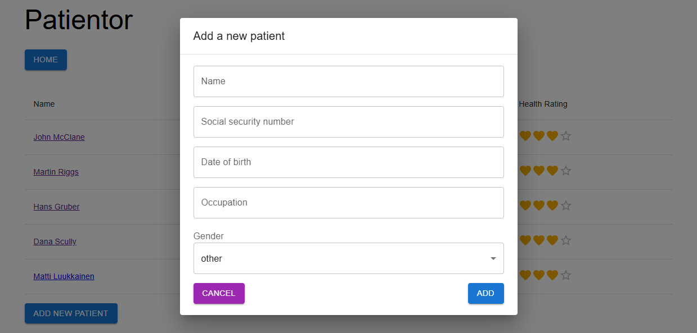

# Patientor frontend:<br> Практический проект на React, TS

URL: [test.ru](https://test.ru/)
BACKEND: [https://github.com/arshtnkv/patientor-express](https://github.com/arshtnkv/patientor-express/)



## Описание:

Простое приложение ведения медицинских карт для врачей, занимающихся диагностикой и обработкой основной медицинской информацией своих пациентов.

Основной упор на оттачивание навыков по TypeScript и MaterialUI.

##

### Технологии:

- React.js
- Axios
- TypeScript
- MaterialUI
- ESLint

### Основные команды:

- Установка зависимостей

```
npm install
```

- Запуск локального сервера

```
npm run dev
```

- Приложение должно работать без backend, но убедитесь, что запрос к `/api/ping`, сделанный при запуске, успешен, прежде чем продолжить.
